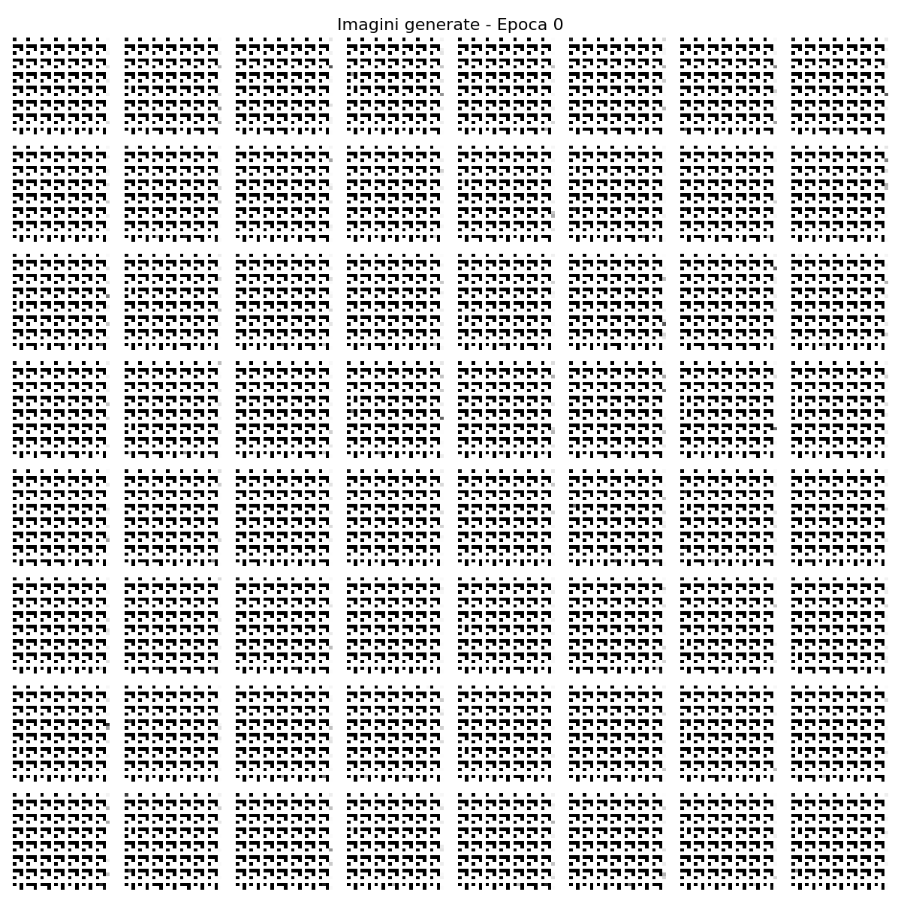
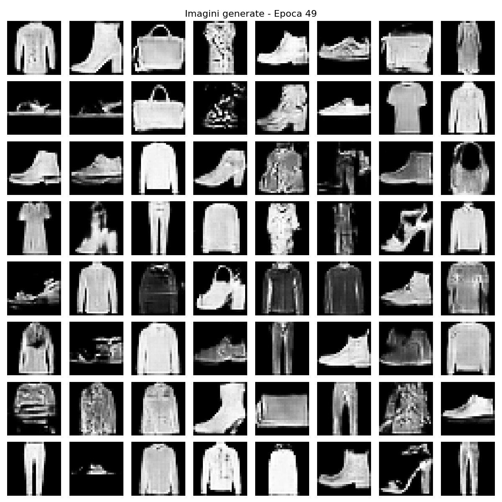

# DCGAN on Fashion-MNIST

A from-scratch PyTorch implementation of a Deep Convolutional GAN (DCGAN) that learns to generate grayscale clothing images, trained on the Fashion-MNIST dataset. Built as a hands-on study of generative adversarial networks — how they work, why they're unstable to train, and how to actually observe that instability instead of just reading about it.

<p align="center">
  
  
</p>
<p align="center"><i>Left: generator output at epoch 0 (pure noise). Right: epoch 49 — recognizable shoes, bags, and clothing.</i></p>

## What this project is

I wanted to understand GANs beyond the surface-level "two networks fight each other" explanation, so I implemented one end to end: data pipeline, generator, discriminator, training loop, and — the part most tutorials skip — actual diagnostics for the training instability that GANs are notorious for. Everything runs in a single notebook, [`DCGAN_FashionMNIST.ipynb`](DCGAN_FashionMNIST.ipynb).

## What I researched

Before writing code, I read the two foundational papers in this space:

- **Radford, Metz & Chintala (2015)**, *Unsupervised Representation Learning with Deep Convolutional GANs* — this is where the DCGAN architectural rules come from: no pooling (use strided/transposed convolutions instead), BatchNorm in both networks, ReLU in the generator, LeakyReLU in the discriminator, and no fully-connected layers.
- **Goodfellow et al. (2014)**, *Generative Adversarial Nets* — the original minimax formulation that explains *why* GAN training is a two-player game rather than a standard optimization problem, and why that makes it fundamentally less stable than supervised learning.

Understanding the theory mattered because almost every design decision in the code traces back to one of these papers — I didn't want to copy an architecture without knowing which rule it was following and why.

## What I built

**Data pipeline** — Fashion-MNIST (60,000 28×28 grayscale images), normalized to `[-1, 1]` to match the generator's `Tanh` output range.

**Generator** — maps a 100-dim latent vector to a 28×28 image using transposed convolutions only:

```
z (100) → 7×7×256 → 14×14×128 → 28×28×64 → 28×28×1
       ConvTranspose2d + BatchNorm + ReLU (×3)     Tanh output
```

**Discriminator** — mirrors the generator, downsampling with strided convolutions:

```
28×28×1 → 14×14×64 → 7×7×128 → 1×1×256 → 1 (real/fake)
   Conv2d + LeakyReLU(0.2) + Dropout(0.3)      Sigmoid output
```
(No BatchNorm on the first discriminator layer — per Radford et al., applying it there hurts stability.)

**Training loop** — standard adversarial setup: BCE loss, Adam optimizers (`lr=2e-4`, `β1=0.5`, the values recommended in the DCGAN paper), 50 epochs, batch size 128.

**Instability monitoring (the part I'm most proud of)** — instead of just training and hoping for good results, I built two diagnostics into the loop, sampled every 500 batches:
- **Gradient norm tracking** for both networks, to catch vanishing/exploding gradients.
- **Mode collapse detection** — measuring the per-pixel standard deviation across a batch of generated images. If the generator starts producing near-identical outputs, that std deviation collapses toward zero.

## Results

- Final loss ratio (D/G) ≈ **0.96** — close to 1 means the generator and discriminator stayed roughly balanced instead of one overpowering the other.
- Gradient norms stayed in a healthy range (generator: 0.004–1.75, discriminator: 0.95–1.8) — no vanishing gradients.
- Mode collapse flagged in only **3 of 50** diagnostic checks (6%) — the generator kept producing diverse outputs for almost the entire run.
- Visually, by epoch 49 the model reliably produces recognizable silhouettes (boots, sneakers, bags, shirts, trousers), though texture quality is inconsistent — some samples are clean, others have noisy/mottled artifacts, which tracks with training being CPU-only and capped at 50 epochs.

## What I learned

- **Why GANs are hard to train.** Unlike a normal loss curve that should converge, GAN losses oscillate by design — the generator improving *causes* the discriminator's loss to rise, and vice versa. Learning to read a loss ratio instead of expecting monotonic decrease was the biggest mental shift.
- **Architectural choices aren't arbitrary.** Every "why not just use a Dense layer here" question I had was already answered in the DCGAN paper — e.g., strided convolutions replacing pooling preserve more spatial information for the generator to learn upsampling patterns from.
- **You can't debug a GAN by loss curves alone.** A "good-looking" loss ratio can still hide mode collapse. Building the per-pixel std-deviation check taught me that generative model evaluation needs metrics that look at *output diversity*, not just the adversarial loss.
- **Training dynamics vs. inference.** Dropout and BatchNorm need `model.eval()` / `model.train()` toggling in exactly the right places (e.g., when generating sample grids mid-training) — getting this wrong silently produces misleading intermediate results.
- **Reproducibility matters even for stochastic models** — seeding `torch`, `numpy`, and CUDA made it possible to reason about whether a change in output was due to my code or just random variation.

## Possible next steps

Things I'd try to push sample quality further, informed by what the diagnostics revealed:
- **Label smoothing** (real labels = 0.9 instead of 1.0) to reduce discriminator overconfidence.
- **Learning rate scheduling** to stabilize the later epochs where loss plateaued.
- **Spectral normalization** as a more principled stability technique than gradient monitoring alone.
- **Longer training on GPU** — this run was CPU-only, which capped both epoch count and batch size experimentation.

## Tech stack

`Python` · `PyTorch` · `torchvision` · `NumPy` · `Matplotlib` · Jupyter Notebook

## Project structure

```
DCGAN_FashionMNIST.ipynb   # full implementation: data, models, training, diagnostics
data/FashionMNIST/         # auto-downloaded dataset
models/                    # saved generator/discriminator weights (final epoch)
generated_images/          # sample grids saved every 5 epochs
epoch/                     # training log screenshots
```

## Running it

```bash
pip install torch torchvision matplotlib numpy
jupyter notebook DCGAN_FashionMNIST.ipynb
```
Fashion-MNIST downloads automatically on first run. A GPU isn't required but will train significantly faster than the CPU run this repo's results came from.

## References

- Radford, A., Metz, L., & Chintala, S. (2015). *Unsupervised Representation Learning with Deep Convolutional Generative Adversarial Networks.* arXiv:1511.06434.
- Goodfellow, I., et al. (2014). *Generative Adversarial Nets.* Advances in Neural Information Processing Systems, 27.
